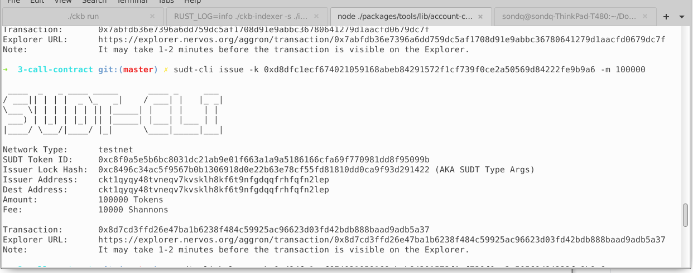
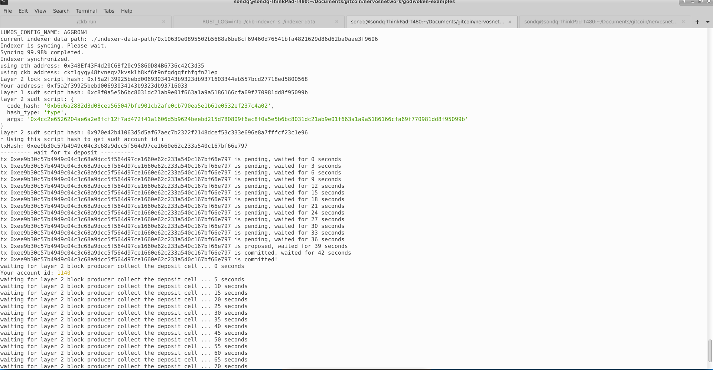
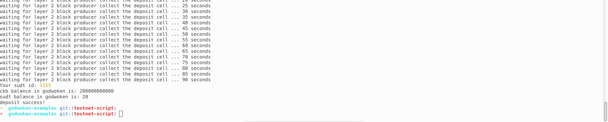

## A link to the Layer 1 address you funded on the Testnet Explorer.

https://explorer.nervos.org/aggron/address/ckt1qyqy48tvneqv7kvsklh8kf6t9nfgdqqfrhfqfn2lep

## A screenshot of the console output immediately after using sudt-cli to create your SUDT tokens on Layer 1.

## A link to the transaction ID created by sudt-cli on the Testnet Explorer.

https://explorer.nervos.org/aggron/transaction/0x8d7cd3ffd26e47ba1b6238f484c59925ac96623d03fd42bdb888baad9adb5a37

## A screenshot of the console output immediately after you have successfully submitted a deposit to Layer 2 using the account-cli tool.

## The SUDT ID from the console output after executing the deposit script (in text format).

1155