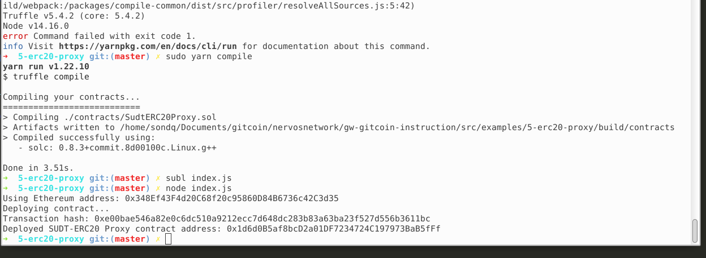
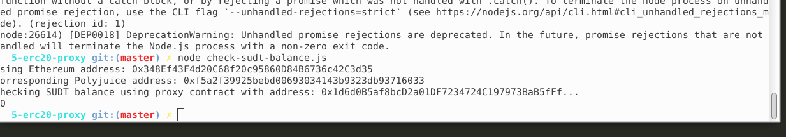

## A screenshot of the console output immediately after deploying smart contract.

## The address of the ERC20 Proxy Contract you deployed (in text format).

0x1d6d0B5af8bcD2a01DF7234724C197973BaB5fFf

## A screenshot of the console output immediately after checking your SUDT balance.

## The Ethereum address that was checked (in text format).

0x348Ef43F4d20C68f20c95860D84B6736c42C3d35