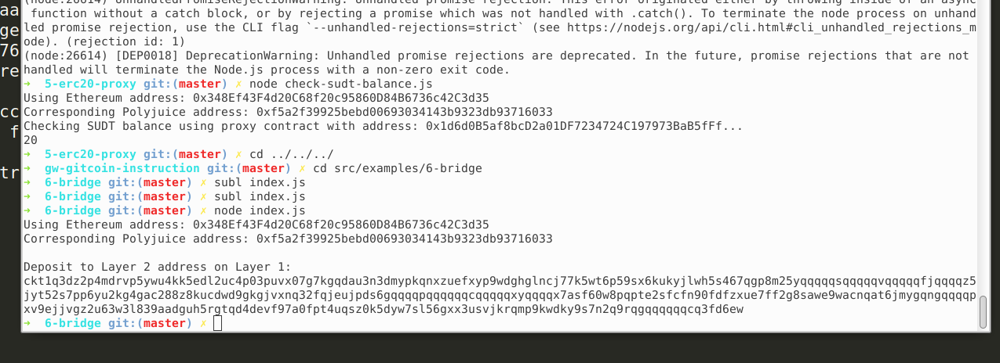

  ### 1.A screenshot of the console output immediately after you have successfully generated your Deposit Receiver Address.
   
  ### 2.Your Deposit Receiver Address (in text format).
   ckt1q3dz2p4mdrvp5ywu4kk5edl2uc4p03puvx07g7kgqdau3n3dmypkqnxzuefxyp9wdghglncj77k5wt6p59sx6kukyjlwh5s467qgp8m25yqqqqqsqqqqqvqqqqqfjqqqqz5jyt52s7pp6yu2kg4gac288z8kucdwd9gkgjvxnq32fqjeujpds6gqqqqpqqqqqqcqqqqqxyqqqqx7asf60w8pqpte2sfcfn90fdfzxue7ff2g8sawe9wacnqat6jmygqngqqqqpxv9ejjvgz2u63w3l839aadguh5rgtqd4devf97a0fpt4uqsz0k5dyw7sl56gxx3usvjkrqmp9kwdky9s7n2q9rqgqqqqqqcq3fd6ew
  ### 3.The Ethereum address used to generate the Deposit Receiver Address (in text format).
  0x348ef43f4d20c68f20c95860d84b6736c42c3d35
  ### 4.A link to the Etherscan explorer for the successful Force Bridge transaction. This can be found on Force Bridge under History→Succeed.
https://rinkeby.etherscan.io/tx/0x172e97fe4c7d1087eb29dc4ff5e6165c9ba6e8e42e3cf1117aa96515059a530c
  ### 5.A link to the Nervos explorer for the successful Force bridge transaction. This can be found on Force Bridge under History→Succeed.
https://explorer.nervos.org/aggron/transaction/0x94e3b6fd81b9342d19c0b5abadf91890ed1c47f10ec4bef444e0d87c80d77b66  