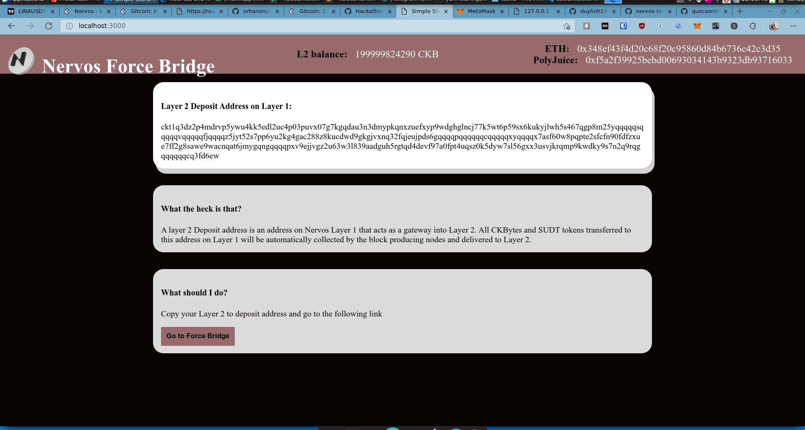

# TASK 8

### 1- A screenshot or video of your EVM application

<

### 2-The address of the SUDT-ERC20 Proxy Contract 

```bash
0x1d6d0B5af8bcD2a01DF7234724C197973BaB5fFf

```

### 3-A link to the GitHub repository 

<a href="https://github.com/quocson95/nervos-force-bridge">GITHUB PROJECT LINK</a>