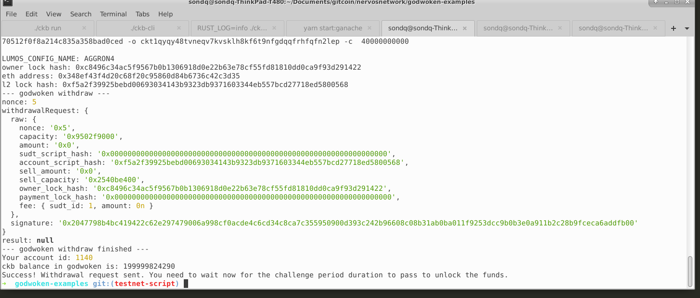

# Gitcoin: 9) Initiate Withdrawal Process From The Layer 2 Back To Layer 1

1. A screenshot of the console output immediately after running the withdraw command.

2. The Ethereum address that you've used for your Layer 2 account (in text format).

`0x348Ef43F4d20C68f20c95860D84B6736c42C3d35`

3. The Nervos Layer 1 address that you passed to withdraw command (in text format).

`ckt1qyqy48tvneqv7kvsklh8kf6t9nfgdqqfrhfqfn2lep`